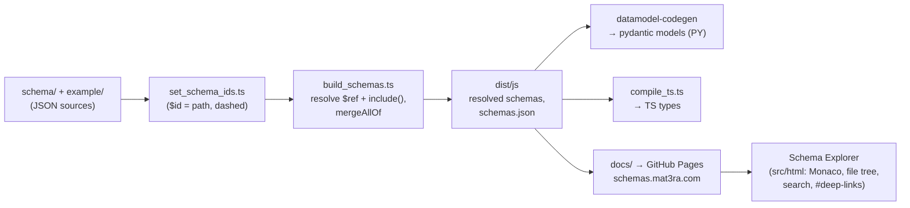

# ESSE Concept Documentation & Entity Map — Implementation Plan

> **Status:** proposal — nothing in this document is built yet.
> **Date:** 2026-08-16 · **Branch:** `claude/repo-docs-entity-map-plan-km8xiz`

This plan proposes two connected additions to ESSE, both published to
[schemas.mat3ra.com](https://schemas.mat3ra.com/) alongside the existing schema explorer:

- **Workstream A — Concept documentation:** a set of pages explaining the approach behind ESSE,
  its main concepts (schema layers, entities, categorization, conventions), and the reasoning
  behind them — the "why", which today lives only in the two papers and in maintainers' heads.
- **Workstream B — Entity map:** an interactive, zoomable, pannable map of every schema and its
  connections — "Google Maps for the ESSE entity graph" — with search, fly-to, deep links, and a
  detail panel per entity.

Both workstreams share one new foundation: a machine-readable **schema graph** extracted from the
JSON sources at build time. The graph feeds the map directly and keeps the documentation honest
(relationship listings in the docs are generated from it, not hand-maintained).

---

## 1. Where things stand today

### 1.1. Inventory

| Asset | Count | Notes |
| --- | --- | --- |
| Schemas (`schema/**/*.json`) | 564 | JSON Schema draft-07, `$id` = path with dashes |
| Examples (`example/**/*.json`) | 209 | Mirror the schema directory layout |
| Top-level schema domains | 23 | Largest: `properties_directory` (85), `methods_category` (79), `core` (73), `workflow` (62), `system` (38) |
| Cross-schema references | 937 | All resolve — zero broken `$ref`s (measured on this branch) |

### 1.2. Existing pipeline and web surface



The deployed site is a single-purpose **file explorer**: a VS Code-style tree over the resolved
schemas and examples with Monaco for JSON viewing, text search over paths, and hash-based deep
links. It answers *"show me schema X"* very well.

### 1.3. What is missing

- **No conceptual documentation.** The README covers installation, usage, and directory naming,
  but the ideas behind the design — why primitives/abstract/reusable layers exist, what
  `*_category` vs `*_directory` means, how CateCom tiers work, how entities compose into
  workflows and jobs — are only discoverable by reading hundreds of schema files or the papers
  ([Data-centric online ecosystem](https://arxiv.org/pdf/1902.10838.pdf),
  [CateCom](https://pubs.acs.org/doi/abs/10.1021/acs.jcim.2c00112)).
- **No way to see the whole.** The explorer shows one file at a time. The structure that makes
  ESSE coherent — 937 references forming an inheritance/composition graph — is invisible. New
  contributors cannot answer "what uses `core/reusable/energy`?" or "what does `material` pull
  in, transitively?" without grepping.

---

## 2. Shared foundation: the schema graph

### 2.1. What the measurement shows (feasibility)

A prototype extraction over the current sources (run while preparing this plan, not committed)
yields a graph that is comfortably small for fully client-side rendering:

- **564 nodes, 937 edges**, zero unresolvable references.
- Edge kinds split into three natural relationship types:
  - **376 `allOf` edges** — *"extends / is-a / mixes-in"* (e.g. `material` → `in_memory_entity/named_defaultable`),
  - **384 `properties`/`items` edges** — *"has-a / contains"* (e.g. `model.method` → `method`),
  - **177 `oneOf`/`anyOf` edges** — *"is one of / variant"* (e.g. property holder unions).
- **Hubs** are meaningful, not noise: `definitions/units` (referenced 30×), `core/primitive/scalar`
  (28×), `core/reusable/energy` (15×), `workflow/unit/context/_base` (15×), `system/entity_reference` (13×).
- **34 isolated nodes** (no inbound or outbound refs) — mostly standalone leaf definitions; the map
  must place them deliberately rather than let a force layout scatter them.

### 2.2. Extractor design

A new build-time script, sibling to the existing ones:

```
src/js/scripts/buildEntityGraph.ts   # reuses walkDirSync + settings.ts SCHEMAS_DIR
```

**Critical constraint:** the extractor must read the **source** schemas (`schema/`), not the
resolved output (`dist/js/schema/`). Resolution inlines `$ref`s and merges `allOf` — exactly the
edges the map exists to show are destroyed by it.

Output: a single `graph.json` (~100–150 KB pretty-printed, well under anything that needs
chunking), emitted into the Pages build alongside `schemas.json`:

```jsonc
{
  "meta": { "generatedFrom": "<git sha>", "nodeCount": 564, "edgeCount": 937 },
  "nodes": [
    {
      "id": "material",                          // $id, dashed form
      "path": "schema/material.json",            // source path, underscored form
      "title": "material schema",
      "description": "…",                        // from schema, may be empty
      "domain": "(root)",                        // top-level directory → map "continent"
      "layer": "entity",                         // classification, see below
      "inDegree": 3, "outDegree": 3,
      "propertyCount": 5,
      "hasExample": true,                        // example/ mirror exists
      "x": 1042.7, "y": -388.1                   // precomputed layout (Phase 2)
    }
  ],
  "edges": [
    { "source": "material", "target": "in-memory-entity/named-defaultable", "kind": "allOf" },
    { "source": "model",    "target": "method", "kind": "property", "label": "method" },
    { "source": "property/holder", "target": "properties-directory/scalar/pressure", "kind": "anyOf" }
  ]
}
```

`layer` is derived from the path and encodes the conceptual role documented in Workstream A:
`primitive` · `abstract` · `reusable` · `reference` · `definition` (units) · `system` ·
`in-memory-entity` (mixins) · `entity` (root-level: material, model, method, property, workflow,
job, project, …) · `category` (`*_category` taxonomies) · `directory` (`*_directory` catalogs) ·
`other`.

### 2.3. Graph invariants as a CI lint (free win)

Because the extractor walks every `$ref`, running it in CI turns it into a schema linter at zero
extra cost. Proposed hard failures: any unresolvable `$ref`; any `$id` violating the
path-with-dashes convention (`set_schema_ids.ts` contract). Proposed warnings (reported, not
failing): newly isolated nodes; `$ref` cycles (the README already forbids them — today there are
none, and this keeps it that way).

### 2.4. Dogfooding

`graph.json` gets its own ESSE schema (e.g. `schema/system/entity_graph.json` — final location up
to maintainers), and the extractor validates its output against it with the already-present `ajv`.
The tooling that documents the schemas is itself documented by a schema.

---

## 3. Workstream A — Concept documentation

### 3.1. Audience and goals

1. **New contributors** (internal or external) who need the mental model before their first PR.
2. **Downstream package authors** (made, code, wode, ade, …) consuming schemas, generated
   pydantic models, and TS types.
3. **Researchers/evaluators** deciding whether to adopt the formats — the papers' ideas, in
   docs form, tied to live schemas.

Goal: a reader with JSON Schema basics understands ESSE's architecture in ~30 minutes and can
locate the right schema for a task without asking.

### 3.2. Proposed table of contents

Ten focused pages, each ending with deep links into the explorer and the map:

1. **Why ESSE exists.** Data-centric materials science; schemas as the single source of truth
   shared by humans, validators, and code generators; design goals (interoperability, validation,
   codegen, human readability); the two papers and what each contributes.
2. **The three artifacts.** Schemas (rules), examples (instances), interfaces (JS/PY accessors +
   generated models/types) — and why examples are first-class, versioned citizens.
3. **Schema layering.** The build-up from `core/primitive` (custom scalars/arrays) → `core/abstract`
   (unit-less math: vectors, matrices, grids, plots) → `core/reusable` (domain blocks: energy,
   band gap, atomic data) → `core/reference` (provenance) → `definitions/units`; why primitives
   "cannot be re-constructed from each other" and what belongs where.
4. **Entity anatomy.** The root entities — material, model, method, property, workflow
   (→ subworkflow → unit), job, project, software/application — and how they compose
   (material carries properties; model wraps method; job binds workflow + compute + project).
   One composition diagram, generated views from the graph.
5. **Behavioral mixins.** `in_memory_entity/*` (named, defaultable, has-metadata, …) and
   `system/*` (soft-removable, sharing, timestampable, status, entity references): how `allOf`
   stacks platform behavior onto domain payloads.
6. **Categorization (CateCom).** `core/reusable/categories` tiers (tier1–3/type/subtype),
   slugified paths, `*_category` trees as taxonomies vs `*_directory` as concrete catalogs;
   worked example: locating an exchange-correlation functional in `methods_category`.
7. **Conventions.** `$id` = path (dash/underscore duality and where each form appears),
   draft-07, no circular refs, `include()` statements (`json_include`), generative keys
   (`isGenerative`), the `manifest/*.yaml` registries, material `hashed`/`enhanced` variants.
8. **The pipeline.** The diagram from §1.2 with prose: what each script does, what lands in
   `dist/`, npm/PyPI packaging, how schemas.mat3ra.com is produced, and how the pre-commit hooks
   keep generated modules in sync.
9. **Consuming ESSE.** JS (`ESSE`, `JSONSchemasInterface`, `validateAndClean`, generated types)
   and PY (`ESSE`, pydantic models under `mat3ra.esse.models`) with runnable snippets; patterns
   used by downstream repos.
10. **Contributing a schema, end to end.** Worked example: add a new scalar property — schema,
    example, manifest entry, id script, rebuild, tests, what CI checks (including the new graph
    lint); glossary appended.

### 3.3. Format and tooling

| Option | Pros | Cons |
| --- | --- | --- |
| **(a) Markdown sources + tiny build-time renderer** (`marked`, one dev dep, wrapped in the site's existing chrome) | Zero new toolchain; matches the hand-rolled, dependency-light style of the explorer; docs versioned with schemas | Sidebar/search hand-built (small, bounded) |
| (b) Static site generator (VitePress / Docusaurus / MkDocs) | Search, nav, theming for free | New toolchain + config surface in a repo that deliberately has none; MkDocs adds a PY doc build to a JS deploy job |
| (c) Prose into a central Mat3ra docs site only | One docs home company-wide | Docs drift from schemas; can't auto-embed graph-derived content; external contributors lose in-repo docs |

**Recommendation: (a)**, with (b) as the fallback if the docs outgrow ten pages. Sources live in
a new `docs_src/` (name open — `docs/` is unavailable: it is the Pages staging dir that CI
overwrites). Cross-link to central Mat3ra docs rather than duplicating into them.

### 3.4. Generated, not hand-maintained, where possible

- Each concept page may embed **generated fragments** from `graph.json`: e.g. page 4's per-entity
  "extends / contains / used by" listings, page 3's layer inventory counts. Regenerated every
  build → documentation cannot silently rot as schemas evolve.
- Diagrams: Mermaid, rendered client-side (CDN, same pattern as Monaco today).

---

## 4. Workstream B — the entity map

### 4.1. Experience spec (the "Google Maps" translation)

| Maps concept | Entity-map equivalent |
| --- | --- |
| Continents / countries | 23 top-level domains as colored regions (convex hulls or compound nodes): core, workflow, properties_directory, … |
| Zoom levels (semantic zoom) | **L0:** domain regions + counts, only hub labels. **L1:** sub-clusters (e.g. `properties_directory/scalar` vs `non-scalar`), major nodes labeled. **L2:** every node labeled, edges visible by kind. **L3 (street view):** ego/focus mode — selected schema + N-hop neighborhood, everything else dimmed. |
| Search + geocoding | Fuzzy search over `$id`/title/description; selecting a result **flies to** the node (animated pan+zoom) and opens its panel |
| Place page | Detail side panel: title, description, `$id`, layer/domain badges; relationship lists (extends / contains / variants / used-by) as clickable rows; links: explorer deep link, GitHub source, raw resolved JSON, example (if `hasExample`) |
| Permalinks | Hash routing `#/entity/<id>` and `#/view/<x,y,zoom>` — shareable, and linkable from docs pages and PR reviews |
| Minimap | Overview inset with viewport rectangle |
| Layers control | Edge-kind toggles (extends / contains / variants), domain filter, "show isolated nodes" toggle |
| Traffic/terrain hints | Node size ∝ in-degree (hubness); optional heat mode for most-referenced schemas |

Isolated nodes (34 today) are parked in a labeled "islands" strip at the map edge instead of
polluting the force layout. Hub fan-out (e.g. `definitions/units` with 30 inbound edges) is kept
legible by fading edges at low zoom and fully drawing them only on hover/selection or in L3.

Visual encoding: **color = domain** (23 hues is too many — group into ~8 families: core,
materials-*, models/methods-*, properties, workflow/job, software/apse, system/in_memory_entity,
other); **shape/border = layer** (§2.2); **edge style = kind** (solid `allOf`, dashed `property`,
dotted `oneOf/anyOf`, arrowheads showing direction).

### 4.2. Rendering technology

| Option | Fit |
| --- | --- |
| **Cytoscape.js (+ fcose layout)** | Graph-native: compound nodes for domain clustering, rich selectors/events, canvas renderer comfortable to ~5k elements (we have ~1.5k). MIT, mature, no framework required — matches the vanilla-JS explorer. **Recommended.** |
| Sigma.js v3 + graphology | WebGL, scales to 100k+ elements — headroom we don't need; weaker styling/compound support, more custom code for panels/interactions. Revisit only if the corpus grows ~10×. |
| D3 + d3-force | Maximum control, most code to own; everything above must be hand-built. |
| React Flow / vis-network | React runtime the repo doesn't have / aging library. Not a fit. |

**Layout strategy — the actual "map" feel:** run the force layout **at build time** (headless —
graphology layouts, or Cytoscape headless + fcose; pick during implementation) and bake `x/y`
into `graph.json`, seeded deterministically. Client loads a finished map instantly, and — like a
real map — **places stay put between visits and releases**, so users build spatial memory.
Client-side layout remains a dev-mode fallback. (MVP ships with client-side fcose; baking arrives
in Phase 2 with layout-stability treated as a soft goal: unchanged schemas keep positions via
seeding, warm-started from the previous release's coordinates.)

### 4.3. Page architecture

```
src/html/map/index.html    # served at schemas.mat3ra.com/map/
src/html/map/map.js        # vanilla JS, same conventions as the explorer app.js
src/html/map/style.css     # shares design language with the explorer
```

Cytoscape from CDN (same pattern as Monaco today; vendoring is an open decision, §8). No
framework, no bundler — consistent with the repo's deliberate zero-build web surface. The map
fetches `graph.json` and, for the detail panel, lazily fetches the already-published resolved
schema JSON.

### 4.4. Explorer ↔ map ↔ docs linking

- Explorer gains a "View on map" action per file; map panel links back to the explorer (mind the
  dash↔underscore mapping between `$id` and published paths — one shared helper).
- A small shared header on all three surfaces: **Docs · Explorer · Map**, plus a landing
  `index.html` refresh to introduce the three views.
- Docs pages link entity mentions to `#/entity/<id>` on the map.

---

## 5. CI and file layout changes

All changes concentrate in the existing `deploy-docs` job (`.github/workflows/cicd.yml`):

```
# after existing "Build" step (npm install, dist → docs copies):
- npm run build-entity-graph          # emits docs/graph.json, validates vs its schema, lints refs
- npm run build-docs-pages            # docs_src/*.md → docs/docs/*.html (workstream A)
- cp -r src/html/map docs/map         # map assets (workstream B)
# existing explorer copy + files.json generation stay as-is
```

New/changed files (full inventory):

```
src/js/scripts/buildEntityGraph.ts    # extractor + lint (Phase 0)
src/js/scripts/buildDocsPages.ts      # markdown → HTML wrapper (Phase 3)
schema/system/entity_graph.json       # schema for graph.json (Phase 0; location TBD)
src/html/map/{index.html,map.js,style.css}          # (Phase 1–2)
docs_src/*.md                         # ten concept pages (Phase 3)
src/html/index.html                   # header/landing touch-up (Phase 4)
tests/js/entityGraph.tests.ts         # extractor tests (Phase 0)
package.json                          # two scripts; dev deps: marked (+ graphology if used)
.github/workflows/cicd.yml            # deploy-docs additions
README.md                             # pointers to docs + map
```

No changes to the published npm/PyPI package contents; everything new is build-time or static
site assets. (Optionally, `graph.json` could later ship in the packages — decision §8.)

---

## 6. Phased delivery

| Phase | Scope | Acceptance | Effort (focused days) |
| --- | --- | --- | --- |
| **0 — Graph foundation** | Extractor, `graph.json` + its schema, ref lint wired into CI, tests | `graph.json` on schemas.mat3ra.com; CI fails on broken `$ref`/`$id`; counts match §2.1 | 1–2 |
| **1 — Map MVP** | Map page: pan/zoom, client-side fcose, domain colors, node sizing, hover highlight, search + fly-to, detail panel with relationship lists + cross-links, `#/entity/` permalinks | A user finds any schema in <10 s and can answer "what uses X?" from the panel | 3–5 |
| **2 — Map polish** | Baked deterministic layout, semantic zoom L0–L3, domain hulls/compounds, edge-kind & domain toggles, minimap, isolated-node strip, hub edge fading | Instant load (no layout jank); zooming feels like a map; positions stable across two consecutive deploys with unchanged schemas | 3–5 |
| **3 — Concept docs** | Ten pages of §3.2, build-time rendering, generated relationship fragments, Mermaid diagrams | Pages live under `/docs/`; generated fragments match `graph.json`; every page cross-links explorer + map | 4–6 (writing-heavy) |
| **4 — Integration & release** | Shared header + landing page, explorer "View on map", README, link checker, smoke tests | Three surfaces mutually navigable; README points to all three | 1–2 |

Phases 1–2 (map) and 3 (docs) are independent after Phase 0 and can proceed in either order or in
parallel. Total: roughly 2–3 focused weeks end to end.

---

## 7. Testing and validation

- **Extractor (Phase 0, mocha in `tests/js/`):** every `$ref` resolves; `$id`↔path convention
  holds for all 564 files; edge-kind partition sums to total; known spot-checks
  (e.g. `material → in-memory-entity/named-defaultable` is an `allOf` edge); `graph.json`
  validates against its own schema via `ajv`.
- **Docs build (Phase 3):** internal link checker over rendered pages (docs↔explorer↔map hrefs);
  generated fragments regenerate byte-identically from the same sources.
- **Map UI:** MVP ships with a manual smoke checklist (load, search, fly-to, panel links, deep
  link into a fresh tab). Optional follow-up: a headless Playwright smoke in CI — kept out of
  scope until the map stabilizes, to avoid burdening a currently browserless CI.
- **Layout stability (Phase 2):** deploy twice from the same sha in a test run; assert identical
  coordinates.

---

## 8. Decisions needed from maintainers

1. **Docs source directory name** — proposal: `docs_src/` (since `docs/` is the Pages build
   output). Alternative: rename the build output dir instead (`site/`) for cleaner naming; that
   touches the Pages config and the workflow.
2. **Docs tooling** — recommended (a) minimal `marked`-based build (§3.3); approve or pick an SSG.
3. **CDN vs vendored JS** — explorer already uses CDN Monaco; keeping CDN for Cytoscape/Mermaid is
   consistent. Vendoring makes the site self-contained/air-gap friendly. Recommendation: stay
   CDN-consistent now, revisit once, for all libs together.
4. **Feature naming** — "Entity Map" (descriptive) vs a product name like **"ESSE Atlas"** used in
   the header. Cosmetic, decide before Phase 4.
5. **Examples on the map** — recommendation: not nodes (doubles clutter for little insight);
   examples surface in the detail panel via `hasExample`. A later "show examples" toggle is cheap
   if wanted.
6. **`graph.json` in the published packages** — not needed for the site; including it would let
   downstream tools (or the platform) reuse the relationship data. Default: site-only for now.
7. **Landing page restructure** (§4.4) — approve the three-surface header on `index.html`.

## 9. Risks and mitigations

| Risk | Mitigation |
| --- | --- |
| Corpus growth degrades map performance | Cytoscape is comfortable to ~5k elements (~3× today's 1.5k). Thresholds documented; Sigma.js/WebGL is the designated escape hatch, and `graph.json` is renderer-agnostic so only the view layer would change. |
| Force layout produces an ugly or unstable map | Build-time layout + deterministic seed + warm-start from previous coordinates (Phase 2); manual per-domain layout hints remain possible since coordinates are baked data, not runtime output. |
| Docs drift from schemas | Generated fragments from `graph.json` each build; concept prose is intentionally structural (layers, patterns) rather than per-schema, so it ages slowly. |
| `docs/` naming confusion bites contributors | Decision §8.1 resolves it; until then, plan consistently says `docs_src/`. |
| Deep-link breakage from dash/underscore duality | One shared `idToPath`/`pathToId` helper used by map, explorer, and docs build; covered by extractor tests. |
| Scope creep into a generated per-schema reference site | Explicit non-goal: the map's detail panel *is* the per-schema reference. Revisit only after Phases 0–4 ship. |

---

## Appendix — measured hubs (current sources)

Most-referenced schemas (inbound edges), from the prototype extraction behind §2.1:

| Schema | In-degree |
| --- | --- |
| `definitions/units` | 30 |
| `core/primitive/scalar` | 28 |
| `core/reusable/energy` | 15 |
| `workflow/unit/context/_base` | 15 |
| `core/primitive/array_of_3_numbers` | 14 |
| `materials_category_components/entities/core/three-dimensional/crystal` | 14 |
| `system/entity_reference` | 13 |
| `core/reusable/categories` | 12 |
| `method/unit_method` | 11 |
| `method` (root) | 10 |

Largest fan-out belongs to `property/holder` (44 outbound refs — the union over all property
types), which is also the strongest argument for the map: it is the kind of structural fact
nobody can currently *see*.
